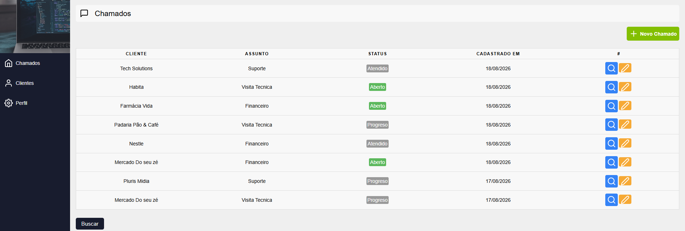
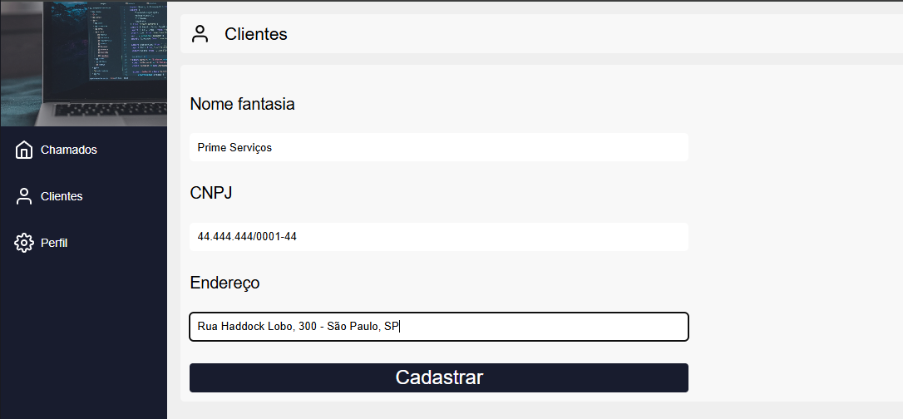
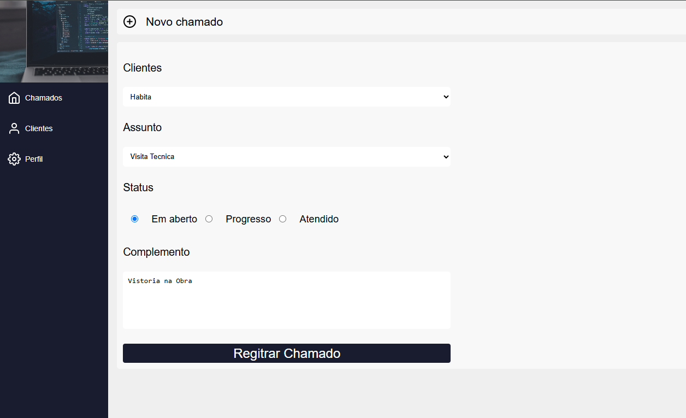
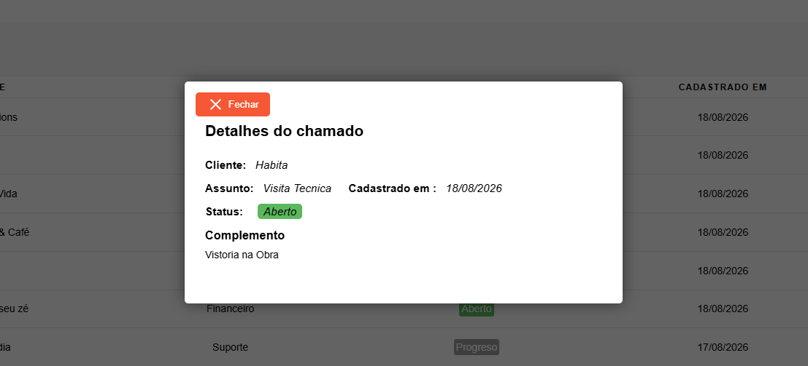

# 🚀✅ Sistema de Chamados - Concluído ✅🚀

 <a href="#-descrição-do-entregável">Descrição do Entregável</a> •
 <a href="#-sobre-o-projeto">Sobre</a> •
 <a href="#-funcionalidades">Funcionalidades</a> •
 <a href="#-layout">Layout</a> •
 <a href="#-Projeto-Online">Projeto Online</a> •
 <a href="#-tecnologias">Tecnologias</a> •
 <a href="#-autor">Autor</a>

---

## 📄 Descrição do entregável

Sistema web para gerenciamento de clientes e chamados, desenvolvido como projeto de estudo para praticar conceitos de desenvolvimento front-end, autenticação e banco de dados FireBase.

A aplicação permite cadastrar clientes, abrir chamados, acompanhar o status dos atendimentos e editar informações dos chamados.

---

## 💻 Sobre o projeto

O **Sistema de Chamados** foi desenvolvido durante meus estudos em React com o principal objetivo de praticar e compreender melhor o funcionamento da **Context API**, utilizando-a principalmente para o gerenciamento e compartilhamento de informações de autenticação entre diferentes componentes da aplicação.

Durante o desenvolvimento, também pude aplicar conceitos como autenticação de usuários, rotas protegidas e integração com o Firebase.

Este foi meu primeiro projeto utilizando a Context API em uma aplicação mais completa, permitindo entender na prática como ela pode facilitar o compartilhamento de estados e funções entre diferentes partes do sistema.

---
## ⚙️ Funcionalidades

* [x] Cadastro de usuários
* [x] Login e logout
* [x] Rotas privadas para usuários autenticados
* [x] Cadastro de clientes
* [x] Listagem de clientesClientes.png
* [x] Abertura de novos chamados
* [x] Listagem dos chamados cadastrados
* [x] Visualização dos detalhes de um chamado através de um modal
* [x] Alteração do status dos chamados
* [x] Edição de chamados

---

## 🎨 Layout

### Tela de chamados

### Cadastro de clientes

### Novo chamado

### Detalhes do chamado

---
## Projeto Online

➡️ [Clique aqui para acessar](https://sistema-de-chamados-delta.vercel.app/profile) 

## 🛠 Tecnologias

As seguintes tecnologias foram utilizadas no desenvolvimento do projeto:

#### Front-end

* React
* JavaScript
* React-Router-DOM
* Context API
* React-Icons
* date-fns
* CSS
* Firebase

## 🦸 Autor

**João Vitor**

Estudante de Engenharia de Software e desenvolvedor front-end em formação.

---

## 📝 Licença

Este projeto foi desenvolvido para fins de estudo e aprendizado.
